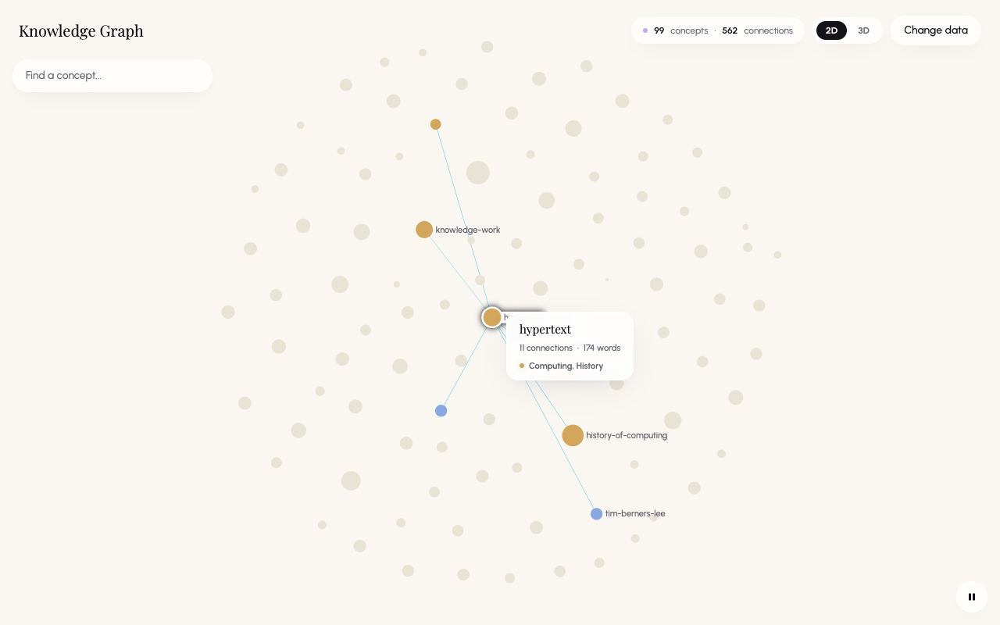
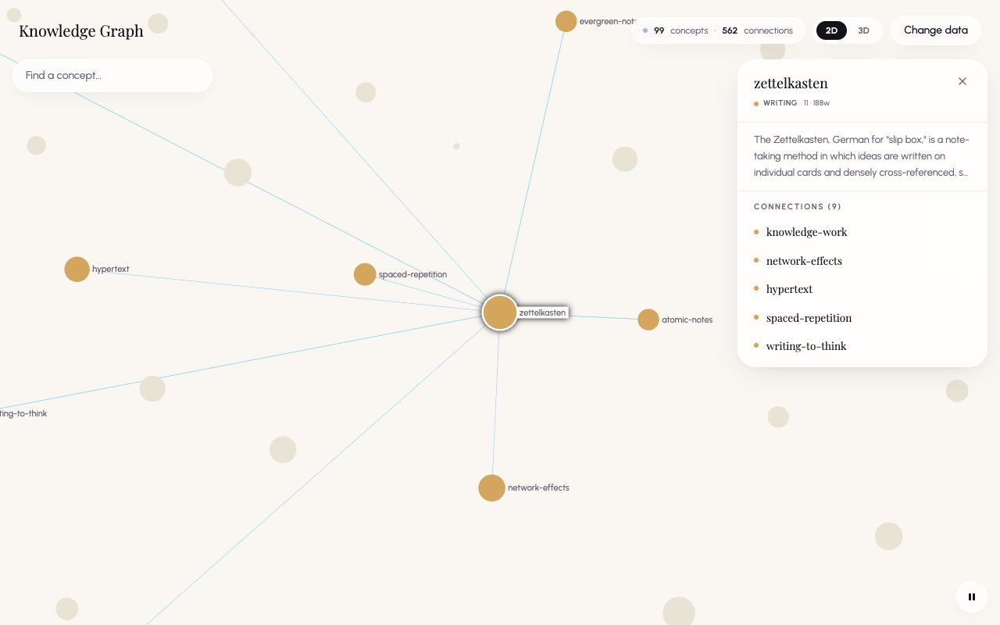
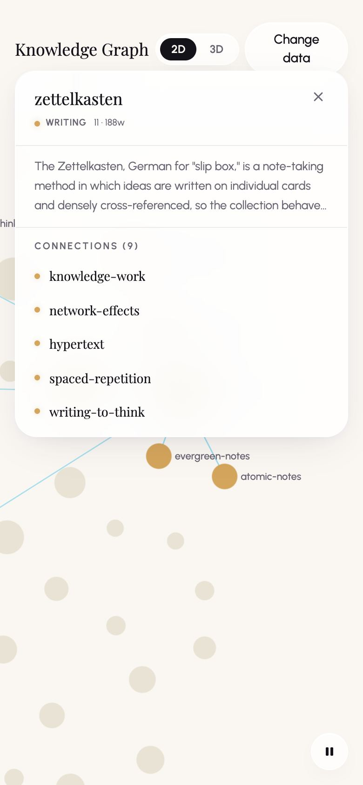

# Features

A tour of what the graph explorer shows and how it encodes the data. For what moves and when, see [Motion and Rotation](motion.md). For input handling, see [Interactions](interactions.md).

## Screen Layout

The explorer fills its parent element and floats its controls over the canvas:

```text
+----------------------------------------------------------------------+
| headerStart      (o 99 concepts . 562 connections) [2D|3D] headerEnd |
|  +--------------------+                       +-------------------+  |
|  | Find a concept...  |                       | Info panel        |  |
|  +--------------------+                       | (while focused)   |  |
|                                               +-------------------+  |
|                                                                      |
|                     graph canvas (2D or 3D view)                     |
|                  the tooltip follows the pointer                     |
|                                                                      |
|                                                    motion button (||)|
+----------------------------------------------------------------------+
```

| Region | Position | Contents |
| --- | --- | --- |
| Header | Top, full width | The `headerStart` slot, the stats pill, the 2D/3D switch, the `headerEnd` slot |
| Search | Under the header, left | The "Find a concept..." box and up to 8 results |
| Info panel | Under the header, right | Details of the focused node |
| Tooltip | Next to the pointer | Quick facts about the hovered node |
| Motion button | Bottom right | Pause and resume |
| Canvas | Behind everything | The 2D or 3D view |

## Header

- **Slots.** `headerStart` and `headerEnd` hold host content. WikiOS puts its site title and a "Back to wiki" link there. The SPA shows a "Knowledge Graph" title and a "Change data" button. The library shows its optional `title`.
- **Stats pill.** Shows "{nodes} concepts · {edges} connections", using `data.nodes.length` and `data.edges.length`. Edges are directed, so two pages that link to each other count as two connections. The words come from the `conceptsLabel` and `connectionsLabel` props. The pill is hidden below 640 px wide.
- **2D/3D switch.** Two buttons with `aria-pressed`. Switching unmounts one view and mounts the other, clears the focus and the tooltip, and saves the choice (see [Persistence](#persistence)).

## The Two Views

| | 2D | 3D |
| --- | --- | --- |
| Engine | sigma.js 3 (WebGL) over a graphology graph | 3d-force-graph (three.js WebGL and d3-force-3d) |
| Layout | ForceAtlas2, 500 iterations, computed once on mount | A force simulation run live in the browser. With motion on when the view mounts, it never stops; see [Motion and Rotation](motion.md#engine-modes) for the other cases |
| Loaded | With the page | The three.js libraries load when the 3D view first mounts: on the first switch, or at page load if 3D was the saved choice. In the SPA they are separate chunks totalling about 1.4 MB; the library build inlines them |
| Camera | Pan and zoom, plus two-finger rotation on touch screens | Orbit, zoom and pan; rotates by itself |
| Node dragging | Not supported | Supported |
| Ambient motion | Small nodes drift | The camera orbits and every node drifts |


## Visual Encoding

### Node Size

Size grows with the backlink count in both views:

- **2D:** radius = clamp(2.5 + 2 × √backlinks, 2.5, 16), in sigma's size units. Sigma scales drawn sizes with the square root of the zoom level, so nodes grow gently as you zoom in.
- **3D:** the node value is 1 + 0.55 × backlinks, and the sphere radius is 4 × ∛value (three-forcegraph's default `nodeRelSize` of 4). Sphere volume therefore grows in step with the backlink count.

| Backlinks | 2D Radius | 3D Radius |
| --- | --- | --- |
| 0 | 2.5 | 4.0 |
| 1 | 4.5 | 4.6 |
| 4 | 6.5 | 5.9 |
| 16 | 10.5 | 8.6 |
| 42 (the largest in the sample vault) | 15.5 | 11.6 |
| 46 or more | 16 (the cap) | keeps growing |

### Colour

A node takes the colour of its first category. A configured alias colour wins; otherwise one of eight palette colours is picked by hashing the category name, so a name always gets the same colour. Nodes without categories are grey (`#c4c0cc`). Both views use the same colours. See [Data](data.md#colours) for the palette and the hashing, and [Styling](styling.md) for every other visual value.

### Labels

- **2D:** sigma draws labels to the right of nodes, in Urbanist 11 px, weight 500, colour `#6b6673`. A node is labelled when its drawn size reaches 6 (`labelRenderedSizeThreshold`), and sigma's label grid thins out crowded labels, favouring larger nodes. At the default zoom, nodes with 4 or more backlinks qualify; zooming in reveals more.
- **3D:** nodes with 4 or more backlinks carry a text sprite (Urbanist, weight 500, 3.4 units tall, `#6b6673`) floating just above the sphere. Sprites always face the camera and have a fixed size in the scene, so they shrink with distance. Smaller nodes have no label in 3D, however close you get.
- The threshold of 4 backlinks is shared on purpose: it is exactly the backlink count at which a 2D node reaches size 6.

### Edges

- **2D:** straight lines of size 0.3, colour `#ece5d2`, without arrows. Sigma never draws an edge thinner than 1.7 px on screen, so at normal zoom every edge is 1.7 px wide. Two pages that link to each other get two overlapping edges.
- **3D:** thin lines in `#d8d2c2` at 35% opacity, without arrows.
- **Weight** (how often one page links to another) is never drawn. In 2D it pulls heavily linked pages closer together in the layout. The 3D simulation ignores it.

### Background

Both views paint `#faf7f3` (`BG_COLOR`, the same value as the `--background` variable).

## Highlighting

Highlighting follows the active node: the focused node or, when nothing is focused, the hovered node.

| Element | 2D | 3D |
| --- | --- | --- |
| Active node | Drawn 1.3× larger, on top, with its label in a white box | Full colour, normal size |
| Neighbours | Full colour. While a node is focused, their labels are forced on; on hover, sigma decides as usual | Full colour, labels fully opaque |
| All other nodes | Faded to `#e8e3d4`, labels removed | Faded to `#e8e3d4`, labels at 15% opacity |
| Edges touching the active node | Teal `rgba(132, 185, 201, 0.85)`, size 1. Because of sigma's 1.7 px minimum, they only look thicker once you zoom in closer than a camera ratio of about 0.35; before that, only the colour changes | Teal `#84b9c9` tubes 1.2 units across, at the same 35% opacity as every link |
| All other edges | Hidden | Unchanged |



## Tooltip

- Appears while the pointer is over a node and nothing is focused. Touch can trigger it too, in the wrong place; see [Interactions](interactions.md#touch).
- Shows the title (in Playfair Display), "{backlinks} connections · {words} words", and every category, after a dot in the first category's colour.
- The "connections" figure in the tooltip is the backlink count, not the number of neighbours.
- Sits 14 px to the right of and 12 px above the pointer, positioned relative to the explorer's root element, so it works inside any host layout. It ignores pointer events.

## Search

- The "Find a concept..." box sits under the header.
- It matches titles only, as a case-insensitive substring, and lists up to 8 results in alphabetical order.
- Picking a result focuses that node and flies the camera to it. In 2D, it zooms in closer than a click does. The query then clears.

## Info Panel

The panel appears while a node is focused.



From top to bottom:

1. The title row. The title comes first, with the first category (after a glowing colour dot) and "{backlinks} · {words}w" beneath it. A close button (×) sits at the right of the row; it clears the focus, and the camera stays where it is.
2. The summary, clamped to three lines.
3. "Open article →", shown only when the host passes `onOpenArticle`.
4. "Connections (N)": the neighbours, sorted by backlink count with the highest first, each with its colour dot. N counts distinct neighbours. Clicking one focuses it and flies there. The list scrolls once it is taller than 14rem.

## Motion Button

- A round button in the bottom-right corner, showing a pause icon while motion runs and a play icon while it is paused.
- Its accessible name is "Pause graph motion" or "Resume graph motion".
- It starts in the paused state when the operating system asks for reduced motion. The choice is not saved between visits.
- What pausing does in each view is described in [Motion and Rotation](motion.md#reduced-motion-and-the-pause-button).

## Responsive Behaviour

| | Narrower Than 640 px | 640 px and Wider |
| --- | --- | --- |
| Stats pill | Hidden | Shown |
| Search box | Full width | 16rem, on the left |
| Info panel | Full width, covering the search box | 20rem, on the right |

- The breakpoint is the browser window's width (a media query), not the explorer's own width. A narrow embed on a wide screen gets the wide layout, where the 16rem search box and the 20rem panel can overlap.
- The top offsets and the motion button include the top and bottom safe-area insets. Browsers only report insets when the page's viewport tag includes `viewport-fit=cover`: the WikiOS app sets it, but the SPA's `index.html` doesn't. Left and right insets are never applied.
- On phones, the info panel grows with its content, up to about 28rem, from just below the header. A full panel covers the middle of the screen, which is where the camera has just centred the focused node, as in the screenshot below.



## Persistence

Only the 2D/3D choice is remembered, in `localStorage` under the `storageKey` prop. The hosts use different keys, so their choices don't collide:

| Host | Key |
| --- | --- |
| WikiOS app (the component's default) | `wikios-graph-mode` |
| Standalone SPA | `wiki-graph-spa-mode` |
| Library | `wiki-graph-embed-mode` |

Storage errors, such as in some private browsing modes, are ignored.

## Performance Profile

- **2D layout:** runs synchronously on the main thread when the view mounts. Its cost grows with the size of the graph.
- **2D rendering:** sigma redraws only when something changes. While drift runs, that is 30 times a second (every frame during the two-second entrance).
- **3D rendering:** redraws every animation frame while the view is mounted, even when motion is paused.
- **Large graphs:** above 600 nodes, the 2D entrance and the drift in both views are switched off. The 3D orbit still runs.
- **Download size:** the 3D libraries load when the 3D view first mounts. In the SPA they are about 1.4 MB minified (about 376 kB gzipped) across three chunks. The initial SPA bundle is about 399 kB minified (114 kB gzipped).
