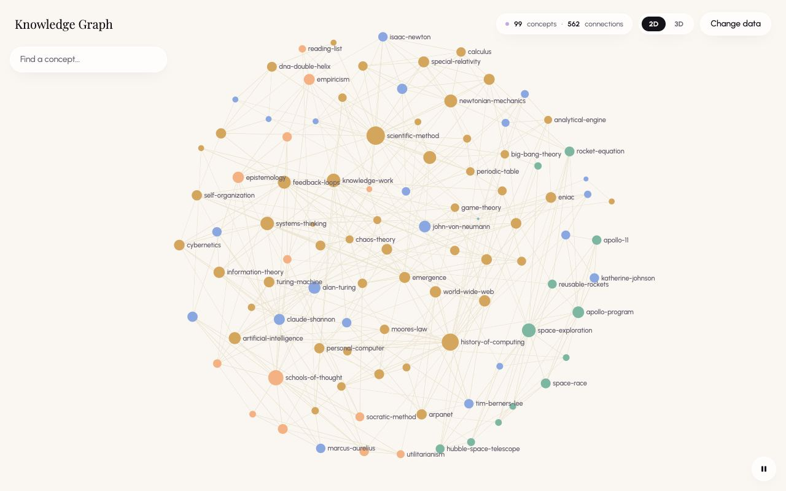
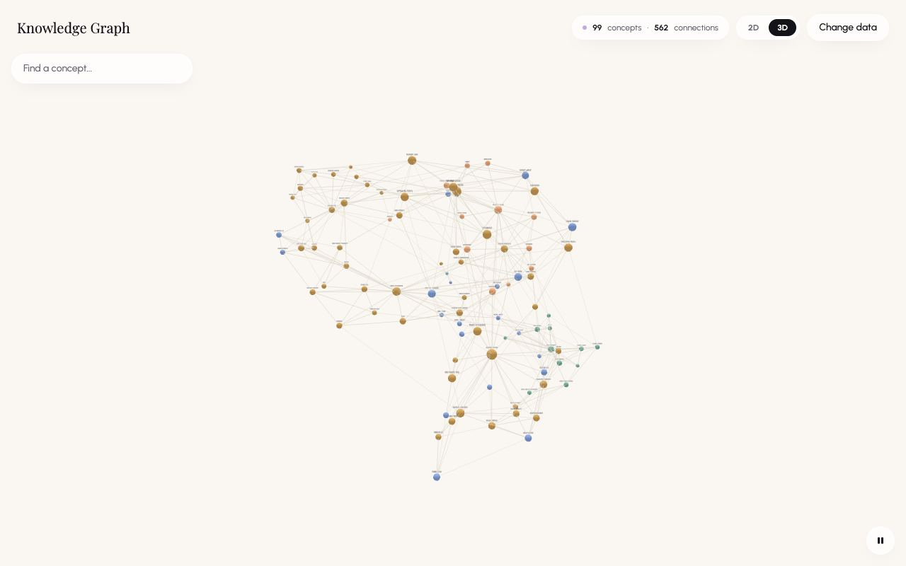
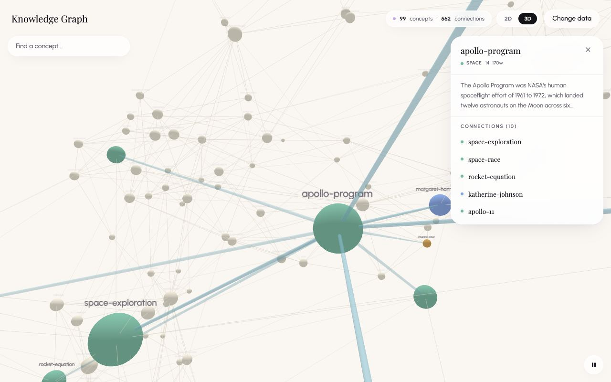

# Motion and Rotation

The explorer layers several kinds of motion: an entrance when a view appears, a slow ambient drift, the 3D camera's orbit, and short camera flights when you focus a node. Both views share one rhythm, so switching between them feels continuous.

| Motion | 2D | 3D |
| --- | --- | --- |
| Entrance | Nodes bloom out from a tight cluster to their places within 2 seconds | The simulation unfolds from a packed ball; at 4.5 s the shape stretches to the screen's proportions, and from 5.9 s the camera reframes it |
| Drift | Small nodes (fewer than 4 backlinks) trace slow loops around their resting positions | Every node traces slow loops in three dimensions, steered by a spring |
| Rotation | None by itself; a two-finger twist rotates the camera on touch screens | The camera orbits the vertical axis at 3.3° per second, one full turn about every 109 seconds |
| Camera flights | An eased pan and zoom to the node, 300 to 400 ms | An eased flight to a viewpoint 130 units beyond the node, 900 ms |
| Pause | The drift stops and nodes snap to rest | The orbit and the drift stop |

## The Shared Rhythm

These constants live in [graph-view-shared.ts](../../src/components/graph-view-shared.ts) and drive the drift in both views:

- **Base cycle.** `AMBIENT_CYCLE_MS` is 26,000 ms, giving a base angular speed of ω = 2π / 26,000 per millisecond.
- **Per-node speed.** Each node multiplies ω by its own factors: 0.75 to 1.25 on x, 0.85 to 1.35 on y and, in 3D, 0.80 to 1.30 on z. A single loop therefore takes roughly 19 to 35 seconds.
- **Per-node phase.** Node number *i* (its position in `data.nodes`) starts at φx = *i* × 2.399963, the golden angle in radians, with φy = 1.7 φx + 1.3 and, in 3D, φz = 2.3 φx + 0.7. The golden angle spreads the nodes evenly around the cycle, so they never pulse in unison.
- **Amplitude.** `AMBIENT_AMPLITUDE_RATIO` is 1.2% of the layout's largest extent, scaled per node by a factor between 0.7 and 1.3.
- **Repeatable randomness.** The per-node factors come from `hash01(seed)`, the fractional part of sin(seed × 127.1 + 311.7) × 43,758.5453. The same data in the same order gets the same speeds, phases and amplitude factors on every load. The positions it moves around still vary: the 2D layout starts from random positions, which also changes the extent that scales the amplitude, and the 3D anchors depend on how many frame-driven ticks ran before they were taken.

Because x follows a sine and y a cosine at slightly different speeds, each node traces a Lissajous figure: a loop whose shape changes slowly, not a line swinging back and forth.

## 2D: Layout, Entrance and Drift



### Layout

1. Every node starts at a random point in a 1000 × 1000 square.
2. ForceAtlas2 runs 500 iterations synchronously, with these settings:

   | Setting | Value | Effect |
   | --- | --- | --- |
   | `linLogMode` | `true` | Tighter clusters with clearer gaps between them |
   | `strongGravityMode` | `true` | Pulls outlying nodes in, keeping the picture compact |
   | `gravity` | 1 | Strength of that pull |
   | `scalingRatio` | 10 | Overall spacing; larger spreads nodes further apart |
   | `slowDown` | 3 | Damps each step for a steadier result |
   | `barnesHutOptimize` | `true` | Approximates distant repulsion for speed (θ = 0.5, the default) |
   | `outboundAttractionDistribution` | `false` | Hubs aren't pushed to the edges |
   | `edgeWeightInfluence` | 1 (the default) | Pages that link to each other often sit closer |

3. The result becomes each node's rest position. Because the start is random, the arrangement differs every time the 2D view mounts.
4. The animator freezes sigma's framing box (`setCustomBBox(getBBox())`) so the camera doesn't re-fit while nodes move.

### Entrance

When the 2D view first mounts with motion on:

- Each node spawns 30% of the way from the graph's centre to its rest position (`ENTRANCE_COLLAPSE`), so the graph starts at 30% of its size.
- After a delay between 0 and 600 ms (`ENTRANCE_STAGGER_MS`, taken from `hash01`), each node glides out to its rest position over 1,400 ms (`ENTRANCE_MS`), easing with easeOutCubic: 1 − (1 − t)³.
- The drift is multiplied by the same progress value, so it fades in without a jump.
- For these first 2 seconds, the positions update on every animation frame.

The result: the graph blooms outward from its centre in under two seconds, with nodes arriving at slightly different times.

### Drift

After the entrance, each node sits at:

```text
x = rest.x + sin(ωx · t + φx) · A
y = rest.y + cos(ωy · t + φy) · A
```

- **Big nodes stay still.** Any node of size 6 or more (4 or more backlinks) gets A = 0 (`LABEL_ANCHOR_SIZE`). These are the nodes sigma labels at the default zoom, and a moving labelled node would make sigma's label selection flicker. In the sample vault, 83 of the 99 nodes are anchored. The drift is carried by the smaller nodes and the edges attached to them.
- **Anchoring is by size, not by label.** Sigma labels by drawn size (size ÷ √ratio). Zoomed in, after a click flight (ratio 0.5) or a search flight (0.3), smaller nodes get labels too, and a focused node's neighbours are always labelled. Those labelled nodes still drift.
- **About 30 frames per second.** After the entrance, a frame is applied only when at least 33.3 ms (`AMBIENT_FRAME_MS`) have passed since the last one, measured on animation-frame timestamps. At 60 Hz two frames sit exactly on that threshold, so in practice it is every second or third frame, roughly 20 to 30 fps. The code notes that this looks the same as 60 fps at this speed and halves the cost.
- **Hover hold.** The node under the pointer freezes: its clock stops, so the tooltip stays on it and a click lands on it. When the pointer leaves, it carries on from the same point in its loop, without a jump.

### Camera Flights

| Trigger | Zoom Ratio | Duration |
| --- | --- | --- |
| Clicking a node | 0.5 | 300 ms |
| Picking a search result | 0.3 | 400 ms |
| Clicking an entry under Connections | 0.5 | 400 ms |

- The zoom ratio is sigma's camera ratio: 1 fits the whole graph and 0.5 is twice as close. It is absolute, so a click zooms to 0.5 even if you had zoomed in further.
- Flights aim at the node's rest position, not its live position, so a flight started during the entrance still lands on the node.
- Flights use sigma's default easing, quadratic in-out.

### Pausing

- Pausing stops the animation loop and snaps every node back to its rest position.
- Resuming starts a fresh animator without an entrance; the loops restart from their first phase.

## 3D: Simulation, Drift and Orbit



### Simulation

- The layout is a d3-force-3d simulation run by 3d-force-graph. The charge is −140, where 3d-force-graph's 3D default is −60 (d3's own default is −30). The link distance is 65, where the default is 30. Together they make dense vaults spread out instead of packing into a tight ball. The library's link and centring forces stay on. Velocity decay (0.4) and alpha decay (0.0228) are the library defaults.
- Nodes start on a golden-angle spiral packed into a small ball (radius 10 × ∛(*i* + 0.5)) and push apart from there. With motion on there are no warm-up ticks, so people watch the graph unfold.
- The simulation ticks once per frame, so how settled the layout is when the drift anchors are taken at 4.5 s depends on the display: about 270 ticks at 60 Hz, 540 at 120 Hz.
- The camera starts 1,000 units out on the z axis, three-render-objects' default. 3d-force-graph would normally move it to ∛N × 170 (about 790 for 99 nodes), but only while the camera is still exactly at x = 0 and y = 0. OrbitControls' first update leaves y at about 6 × 10⁻¹⁴, so that never happens here, and the first reframing is the camera fit at 5.9 s.

### Engine Modes

The 3D engine runs in one of three modes, chosen when the view mounts:

| Condition at Mount | Setup | Behaviour |
| --- | --- | --- |
| Motion on, 600 nodes or fewer | `cooldownTime(Infinity)`, the `drift` force installed, drift anchors taken at 4.5 s | The engine ticks for the life of the view. Pausing later only turns off the orbit and makes the drift force do nothing |
| Motion off | `warmupTicks(160)`, then `cooldownTicks(0)` | The layout settles before the first frame and the engine stops. Resuming later restores the orbit only; the simulation never restarts |
| Motion on, more than 600 nodes | Library defaults | The engine stops after 15 seconds and the camera fits with `zoomToFit(800, 40)`. The orbit still runs |

In the first mode the engine never stops ticking, but d3's alpha still decays each tick, so the link and charge forces, which scale with alpha, fade out within seconds. The centring force and the drift force don't scale with alpha, so the drift carries on. A port whose drift force scales with alpha would stop drifting.

### Timeline

With motion on and no more than 600 nodes, counting from the moment the 3D view mounts (after its code has loaded):

| Time | What Happens |
| --- | --- |
| 0 s | The simulation and the orbit start |
| 4.5 s (`DRIFT_SETTLE_MS`) | Current positions become drift anchors, stretched to the viewport's proportions |
| 4.5 to 5.9 s | The drift spring glides the nodes onto their stretched anchors |
| 5.9 s (`DRIFT_SETTLE_MS` + `STRETCH_SETTLE_MS`) | The camera fit starts and runs for 800 ms. It is skipped if the canvas has already been pressed, scrolled or touched (even a plain click counts) or a node focused |
| From then on | The drift continues indefinitely, on an engine that keeps ticking (see [Engine Modes](#engine-modes)) |

### Stretching to the Screen

- The aspect ratio is the container's width divided by its height.
- On a landscape screen, the x and z anchors are multiplied by the aspect ratio, capped at 1.7 (`STRETCH_MAX`). The constellation becomes a wide disc.
- On a portrait screen, the y anchors are multiplied by 1 ÷ aspect ratio, capped at 1.7. The constellation becomes a tall cloud.
- The stretch stays symmetric around the vertical axis because the camera orbits that axis. Stretching only x would make the silhouette swell and shrink as the camera turns.

### Drift

- A custom d3 force named `drift` runs on every simulation tick. Each node's target is its anchor plus (sin(ωx · t + φx), cos(ωy · t + φy), sin(ωz · t + φz)) × A.
- Here A is 1.2% × 1.4 of the largest stretched extent, times the node's factor between 0.7 and 1.3. The extra 1.4 makes up for the spring's lag, so the visible sway roughly matches the 2D view.
- Steering: each tick adds (target − position) × 0.03 (`DRIFT_SPRING`) to the node's velocity. The physics engine moves the node, so links, spheres and labels stay attached.
- Every node drifts; there is no label anchoring in 3D.
- A node that is being dragged is skipped. Once released, it rejoins the drift.

### Camera Fit

3d-force-graph's `zoomToFit` measures the graph as a single number checked against the vertical field of view, which would cancel the horizontal stretch. The 3D view therefore fits the camera itself:

- The half-width H is the largest |x| or |z| of any anchor (the orbit swaps x and z as it turns). The half-height V is the largest |y|.
- With tan(v) = tan(fov ÷ 2) and tan(h) = tan(v) × aspect ratio, the distance is max(V ÷ tan(v) + H, H ÷ tan(h) + H) × 1.08 (`FIT_DISTANCE_SLACK`).
- The "+ H" term allows for the nearest node sitting H in front of the centre.
- The camera moves along its current line of sight to that distance, aiming at the centre, over 800 ms (`ZOOM_FIT_MS`).

The fit is deliberately cautious. It assumes the widest node could also be the nearest one at any point in the orbit, so the settled constellation sits well inside the frame, as in the screenshot above.

When motion is off at mount, or the graph is too large for drift, the view uses the library's `zoomToFit` instead (800 ms, 40 px padding) once the simulation stops. A press on the canvas before then cancels that fit too.

### Orbit

- **Speed.** Rotation uses three.js `OrbitControls` with `autoRotate` on and `autoRotateSpeed` set to 0.55 (`AUTO_ROTATE_SPEED`). That is 2π ÷ 60 × 0.55 radians, about 3.3°, per second, so one full turn takes 60 ÷ 0.55 ≈ 109 seconds.
- **Frame rate.** The rotation is time-based: the renderer passes the elapsed seconds to the controls, capped at 1 second per frame. It turns at the same speed on 60 Hz and 120 Hz displays. After a tab has been in the background, the first frame jumps by at most one second's worth (about 3.3°) and the orbit carries on.
- **Direction.** Seen from above, the camera travels clockwise. On screen, the side of the graph nearest you slides to the right and the far side slides to the left.
- **Axis.** The vertical line through the orbit target, which starts at the layout's centre. Focusing a node re-aims the camera at the node's position at that moment, so the orbit then circles that point. The node itself keeps drifting around it. Clearing the focus doesn't move the camera back.
- **Taking over.** OrbitControls fires its `start` event on any pointer press on the canvas, with any button and even without movement, on every wheel step and on touch start. So any orbit, zoom or pan gesture, and even a plain click on a node or the background, stops the rotation at once. It resumes 6 seconds after the press or gesture ends (`AUTO_ROTATE_RESUME_MS`), provided motion is still on. Each new press restarts the countdown.



### Camera Flights

- Focusing a node by clicking it, picking it in search or choosing it under Connections moves the camera to node × (1 + 130 ÷ |node|). That point is on the line from the centre through the node, 130 units beyond it (`FOCUS_CAMERA_DISTANCE`), looking back at the node.
- The camera position eases over 900 ms (quadratic out), and the aim point eases over the first 300 ms.
- The zoom ratio used in 2D is ignored: every 3D flight ends at the same distance from its node.
- A flight counts as moving the camera, so it cancels a pending camera fit.
- If a fit or another flight is still animating when a new one starts, the running tweens are ended first. The camera snaps to their end point, then the new flight begins.

### Pausing

- Pausing turns off the orbit and makes the drift force do nothing, so the nodes come to rest where they are. The renderer keeps drawing.
- Resuming turns both back on.
- If the 3D view mounted while motion was off, it starts already at rest and resuming brings back only the orbit (see [Engine Modes](#engine-modes)). The drift returns the next time the 3D view mounts.

## Reduced Motion and the Pause Button

- **At start.** Motion is on unless the browser reports `prefers-reduced-motion: reduce`.
- **During a session.** If that preference switches to reduce while the graph is open, motion turns off. Switching the preference back doesn't turn motion on again; the pause button does.
- **The button.** It toggles motion for whichever view is showing. Its state isn't saved between visits.
- **Why.** WCAG 2.2.2 (Pause, Stop, Hide) requires a way to pause motion that starts automatically and lasts longer than five seconds.

| Motion Off Means | 2D | 3D |
| --- | --- | --- |
| Entrance | None; nodes appear at rest | None; the layout settles before the first frame (if motion was off at mount) |
| Drift | Stopped | Stopped |
| Orbit | Not applicable | Stopped |
| Camera flights and zoom animations | Still animate (they follow the user's own actions) | Still animate |

## Large Graphs

Above 600 nodes (`MAX_ANIMATED_NODES`), per-frame animation stops being cheap, so:

- the 2D view skips the entrance and the drift, and shows a still graph;
- the 3D view skips the drift, lets the simulation run for the library's default 15 seconds, then stops it and fits the camera;
- the 3D orbit still runs if motion is on.

## Tuning Reference

| Constant | Value | File | Effect |
| --- | --- | --- | --- |
| `AMBIENT_CYCLE_MS` | 26000 | graph-view-shared.ts | Base drift cycle for both views; larger is slower |
| `AMBIENT_AMPLITUDE_RATIO` | 0.012 | graph-view-shared.ts | Drift size as a share of the layout's extent |
| `GOLDEN_ANGLE` | 2.399963 | graph-view-shared.ts | Phase step between consecutive nodes |
| `MAX_ANIMATED_NODES` | 600 | graph-view-shared.ts | Above this, the entrance and drift are skipped |
| `ENTRANCE_MS` | 1400 | graph-explorer.tsx | Length of each node's 2D entrance glide |
| `ENTRANCE_STAGGER_MS` | 600 | graph-explorer.tsx | Maximum per-node delay before the glide starts |
| `ENTRANCE_COLLAPSE` | 0.3 | graph-explorer.tsx | Starting scale of the 2D entrance |
| `AMBIENT_FRAME_MS` | 1000 ÷ 30 | graph-explorer.tsx | Time between 2D drift frames after the entrance |
| `LABEL_ANCHOR_SIZE` | 6 | graph-explorer.tsx | 2D nodes at least this big don't drift |
| `AUTO_ROTATE_SPEED` | 0.55 | graph-3d-view.tsx | Orbit speed; seconds per turn = 60 ÷ speed |
| `AUTO_ROTATE_RESUME_MS` | 6000 | graph-3d-view.tsx | Pause after a press or gesture before the orbit resumes |
| `FOCUS_CAMERA_DISTANCE` | 130 | graph-3d-view.tsx | How far beyond a focused node the camera stops |
| `LABEL_MIN_BACKLINKS` | 4 | graph-3d-view.tsx | Minimum backlinks for a 3D label |
| `NODE_REL_SIZE` | 4 | graph-3d-view.tsx | Mirrors three-forcegraph's `nodeRelSize` to place labels above spheres |
| `DRIFT_SETTLE_MS` | 4500 | graph-3d-view.tsx | Time the 3D layout gets before drift anchors are taken |
| `DRIFT_SPRING` | 0.03 | graph-3d-view.tsx | How firmly nodes are steered towards their drift targets |
| `CHARGE_STRENGTH` | −140 | graph-3d-view.tsx | Repulsion between 3D nodes |
| `LINK_DISTANCE` | 65 | graph-3d-view.tsx | Preferred 3D edge length |
| `ZOOM_FIT_MS` | 800 | graph-3d-view.tsx | Length of the 3D camera fit |
| `ZOOM_FIT_PADDING` | 40 | graph-3d-view.tsx | Padding for the library's fit (motion off or large graphs) |
| `STRETCH_MAX` | 1.7 | graph-3d-view.tsx | Largest stretch towards the screen's proportions |
| `STRETCH_SETTLE_MS` | 1400 | graph-3d-view.tsx | Time allowed for the glide onto stretched anchors |
| `FIT_DISTANCE_SLACK` | 1.08 | graph-3d-view.tsx | Extra room in the 3D camera fit |

### Recipes

- **Faster orbit:** set `AUTO_ROTATE_SPEED` to 1.1 for about 55 seconds per turn.
- **Reverse the orbit:** use a negative `AUTO_ROTATE_SPEED`.
- **Calmer drift:** lower `AMBIENT_AMPLITUDE_RATIO`. For slower drift, raise `AMBIENT_CYCLE_MS`. Both views follow either change.
- **Let labelled 2D nodes drift too:** raise `LABEL_ANCHOR_SIZE` above 16, the largest 2D node size. The code warns that labels will then flicker as sigma re-picks them.
- **Skip the 2D entrance:** create the animator with `{ entrance: false }`, as the resume path already does.
- **Resume the orbit sooner after a gesture:** lower `AUTO_ROTATE_RESUME_MS`.
